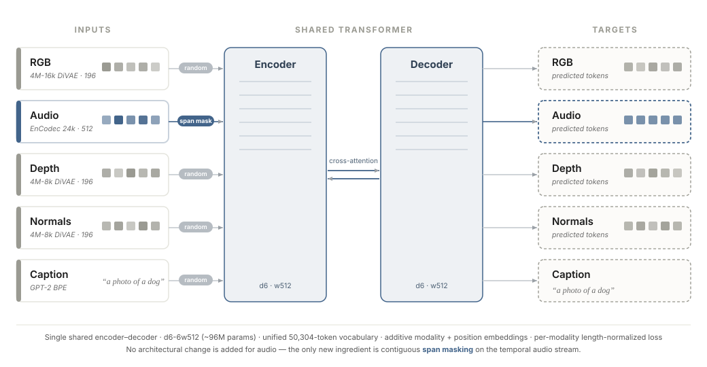

# nano4M-Audio

> Extending the 4M masked-multimodal framework to **audio** as a 5th modality.
> A controlled study at small academic scale — COM-304, EPFL, Spring 2026.



## Quick links

- 🌐 **Project website:** https://ziyad-m97.github.io/nano4M-Audio/
- 📄 **Report (PDF):** [`docs/assets/report.pdf`](docs/assets/report.pdf)
- 🎤 **Slides (PDF):** [`docs/assets/slides.pdf`](docs/assets/slides.pdf)
- 🤗 **Trained checkpoint:** _to upload_ → `ziyad-m97/nano4m-audio` (see [`outputs/README.md`](outputs/README.md))
- 📊 **Tokenized dataset:** _to upload_ → `ziyad-m97/nano4m-audio-tokenized` (see [`data/README.md`](data/README.md))

## TL;DR

We extend **nano4M** (a d6-6w512 encoder–decoder transformer, **~95.8M params**) with audio as a
5th modality via EnCodec tokenization and contiguous **span masking**. We train on a self-collected
dataset of **9,192 animal-vocalization clips** across 11 classes, cleaned with a 3-stage oracle
(PANNs → CLIP → Silero VAD). Structural modalities (depth, normal) converge strongly; the iterative
generation framework works in the structural directions; audio learns conditional structure at the
token level (audio CE 5.2 nats, ~1 nat below its marginal) **but does not lift to usable cross-modal
generation**. We diagnose three causes — a train/inference masking mismatch, an acoustic-only
tokenizer, and a data-scale gap — and propose a validated next step for each. **The precise
diagnostic, not the generation, is the contribution.**

This repository is a **curated, runnable subset** of four weeks of work on the EPFL SCITAS Kuma
cluster: the modified nano4M code, the final config, the data/tokenization/eval pipeline, the
deterministic split, the real evaluation outputs, and the report figures.

## Setup

Tested on Linux + CUDA 12.1, Python 3.10. The model code builds on the open-source
[`apple/ml-4m`](https://github.com/apple/ml-4m) package.

```bash
# Option A — pip
python -m venv .venv && source .venv/bin/activate
pip install -r requirements.txt
pip install -e .                      # installs the local `nanofm` package

# Option B — conda
conda env create -f environment.yml
conda activate nanofm
pip install -e .
```

### Fast path — reproduce the evaluation (~15 min, no training)

```bash
# 1. Download the pre-tokenized dataset (~500 MB)  [host: HuggingFace — see data/README.md]
huggingface-cli download ziyad-m97/nano4m-audio-tokenized --repo-type dataset \
    --local-dir data/tokenized_v5

# 2. Download the trained checkpoint (~370 MB)      [see outputs/README.md]
huggingface-cli download ziyad-m97/nano4m-audio checkpoint-final.safetensors \
    --local-dir outputs/animal_full_5mod_v5

# 3. Run the evaluation notebook (or scripts) — regenerates figures + eval_results/
jupyter notebook notebooks/final_evaluation.ipynb
```

The committed [`eval_results/`](eval_results/) and [`figures/`](figures/) already contain the
**actual outputs** of this run, so the report's numbers are verifiable without re-running anything.

### Full path — reproduce from scratch

See [`docs/REPRODUCIBILITY.md`](docs/REPRODUCIBILITY.md): raw data → 3-stage filter → 5-modality
tokenization → deterministic split → training (18.3k steps, ~1h10 on 1× H100) → evaluation.

```bash
torchrun --nproc_per_node=1 run_training.py --config cfgs/nano4M/animal_full_5mod_v5.yaml
```

## Repository structure

```
nano4M-Audio/
├── nanofm/                 ← model code (modified from apple/ml-4m); FourM + span masking
│   ├── models/fourm.py        ← 5-modality model (unified vocab = max(vocab_sizes))
│   └── data/multimodal/
│       ├── masking.py          ← Dirichlet masking + span masking (the contribution)
│       └── simple_multimodal_dataset.py
├── run_training.py         ← training entrypoint (Hydra-instantiated config)
├── cfgs/nano4M/animal_full_5mod_v5.yaml   ← THE final training config
├── splits.json             ← deterministic clip-level split (seed=42) — the reproducibility artifact
├── scripts/
│   ├── data_collection/    ← downloader + (filter pipeline documented in DATASET.md)
│   ├── tokenization/       ← EnCodec audio · 4M-16k RGB · DAv2 depth · DSINE normal
│   ├── splits/             ← stratified split + the v5 merge/offset that built splits.json
│   ├── evaluation/         ← the full eval suite (CE, classification, retrieval, generation)
│   └── slurm/              ← SBATCH launchers + the training orchestrator
├── notebooks/final_evaluation.ipynb
├── eval_results/           ← the ACTUAL eval outputs (JSON) behind the report numbers
├── figures/                ← the real report figures (+ appendix/) and regeneration script
├── data/                   ← README + metadata/ manifests (no clips/tokens committed)
├── outputs/                ← README (checkpoint hosting; no checkpoint committed)
└── docs/                   ← the deployed website (index.html, assets/) + engineering docs:
    ├── REPRODUCIBILITY.md  ←   step-by-step reproduction
    ├── DATASET.md          ←   sources, filter thresholds, statistics
    ├── ARCHITECTURE.md     ←   model details, unified vocab, span masking
    └── ABLATIONS.md        ←   the engineering decisions
```

## Reproducing the report figures

| Figure | How |
|--------|-----|
| Architecture diagram | `docs/assets/img/method.svg` (hand-authored SVG) |
| Per-modality CE drop | `python figures/render_fig1.py` (data: `eval_results/fig1_ce_drop.json`) |
| Depth/Normal reconstruction | notebook cell / `scripts/evaluation/make_report_figures.py` → `figures/reconstruction_gallery.png` |
| Caption→RGB gallery | `scripts/evaluation/make_report_figures.py` → `figures/caption2rgb_gallery.png` |
| Framework-validation directions | `figures/sanity_check_directions.png` (data: `eval_results/sanity_check_directions.json`) |
| Audio CE vs marginal | `docs/assets/img/audio_ce_vs_marginal.svg` (data: `eval_results/fig1_ce_drop.json`) |
| Appendix (confusion, audio→RGB grid, spectrograms, retrieval) | `figures/appendix/` |

## Citation

```bibtex
@misc{nano4m-audio-2026,
  author      = {Mellal, Ziyad and Baddour, Hassan and Farhat, Marc},
  title       = {Nano4M-Audio: Adding Audio as a 5th Modality to the 4M Architecture},
  year        = {2026},
  institution = {EPFL, COM-304},
  url         = {https://github.com/ziyad-m97/nano4M-Audio}
}
```

## Acknowledgements

Supervised by **Jason Toskov** at EPFL VILAB. Built on the open-source 4M codebase
([apple/ml-4m](https://github.com/apple/ml-4m); Mizrahi et al., NeurIPS 2023; Bachmann et al.,
NeurIPS 2024). Compute provided by the EPFL SCITAS Kuma cluster.

## License

MIT for this repository's contributions (see [`LICENSE`](LICENSE)). The underlying 4M code is
licensed under its own terms (Apache-2.0). The website under `docs/` reuses the
[Nerfies template](https://github.com/nerfies/nerfies.github.io) (CC BY-SA 4.0).
